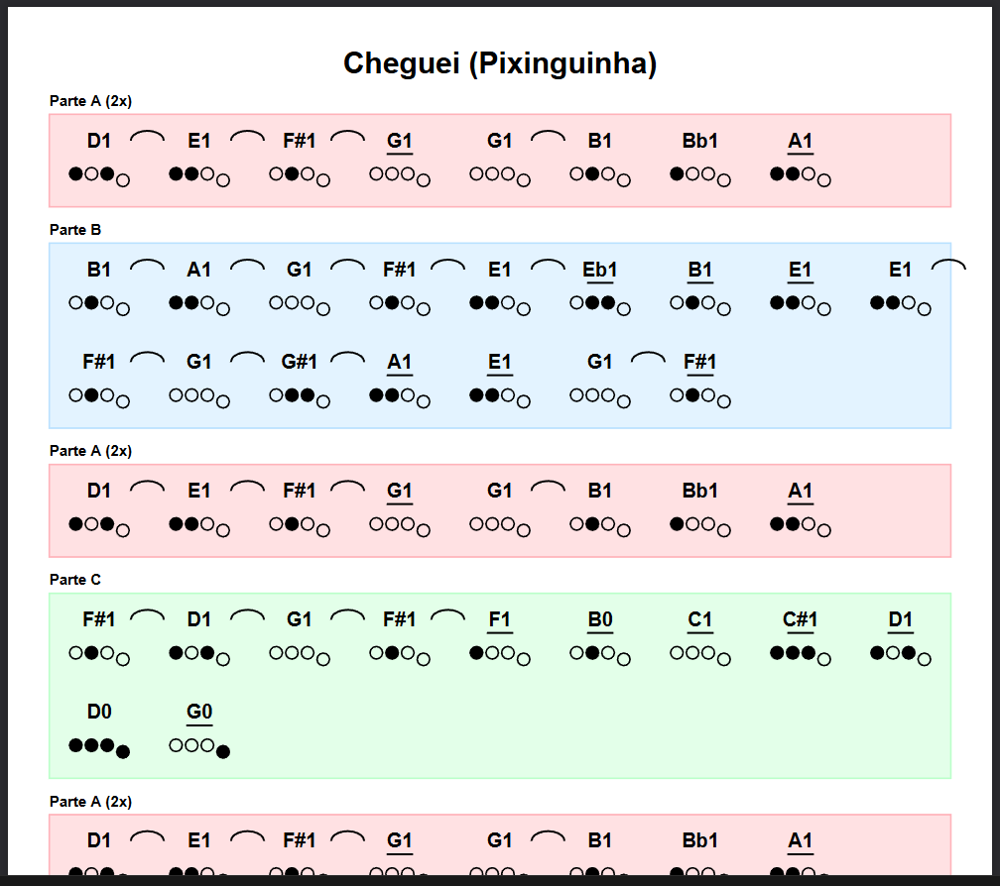

# Bombardinha

Bombardinha is a tool designed for 4-valve euphonium players who are not yet proficient in reading traditional sheet music. It allows users to write music using a simplified text notation and generates a PDF containing intuitive visual representations, specifically focusing on valve fingerings.

The project was created to lower the barrier for beginners, providing a middle ground between "playing by ear" and formal music notation by showing exactly which valves to press for every note.

> The name Bombardinha is a portmanteau of **bombardino** (the brazilian name for the euphonium) and **barbadinha** (a brazilian portuguese slang for something very easy or a "sure thing").

## Notation System

The project uses a reduced notation system to represent how notes should be played. In the generated PDF, each note block includes the note name and a visual representation of the four valves.

### Durations and Articulation

<br />
<p align="center">
  
</p>
<br />

- **Short (.)**: Indicated by a dot after the note (e.g., `G.`). In the PDF, this is represented by a small staccato dot.
- **Normal**: No symbol is added. This is the default state.
- **Long (\_)**: Indicated by an underscore (e.g., `G_`). In the PDF, these notes have a horizontal bar below them, indicating the note should be held.
- **Connected (-)**: Indicated by a hyphen (e.g., `D-`). This represents a "ligature" or "slur," telling the player to transition quickly between notes in a fast chain. In the PDF, this is visualized with an arc connecting the notes.

Symbols can be combined. For example, `C_-` represents a note that is both long and connected to the next.

## File Syntax (.bomba)

The `.bomba` file structure is designed to be human-readable and easy to type.

1.  **Title**: The first line of the file is always the song title.
2.  **Part Definitions**: Parts are defined using headers in the format `[Display Name] [id]`.
    - The **Display Name** is what appears on the PDF.
    - The **ID** is a short alphanumeric reference used to organize the song structure.
3.  **Notes**: Notes are written inside the parts, separated by spaces.
    - **Accidentals**: Use `#` or `s` for sharps and `b` for flats (e.g., `F#`, `Eb`, `Fs`).
    - **Octaves**: A number can be added to define the octave (e.g., `C2`). If omitted, it defaults to octave 1.
4.  **Order**: The `[Order]` section defines the sequence of the song using the part IDs followed by the number of repetitions.

### Example

```text
Song Title

[Chorus] [c]
C  D  E  F_
G. G. A  G- F- E

[Order]
c 2
```

## Installation and Usage

The project uses **Poetry** for dependency management.

### Installation

**Windows:**

```powershell
(Invoke-WebRequest -Uri https://install.python-poetry.org -UseBasicParsing).Content | py -
```

**Linux and macOS:**

```bash
curl -sSL https://install.python-poetry.org | python3 -
```

### Initializing the project

Once Poetry is installed, navigate to the project directory and run:

```bash
poetry install
```

### Running the project

To generate a PDF from your `.bomba` files, place your script in the `input` folder and execute:

```bash
poetry run python -m bombardinha.main
```

The program will list the available files in the input directory. Select the index of the file you wish to process, and the resulting PDF will be saved in the `output` folder with a timestamped filename.
